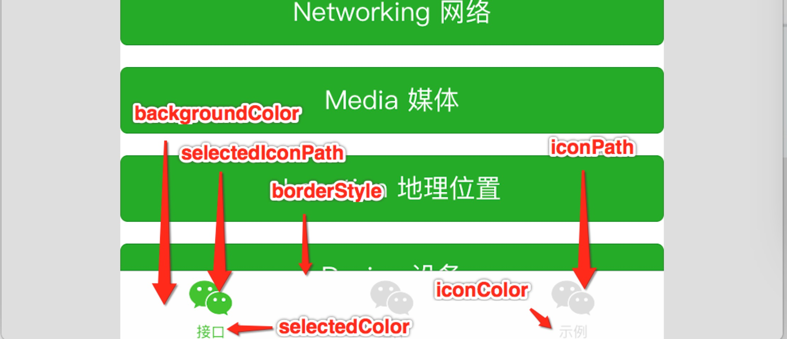

#微信小程序框架

来源 https://mp.weixin.qq.com/debug/wxadoc/dev/framework/MINA.html?t=1474644084689

制作 蓝点工坊<bluedrum@qq.com>


##一.框架介绍


小程序开发框架的目标是通过尽可能简单、高效的方式让开发者可以在微信中开发具有原生 APP 体验的服务。

框架提供了自己的视图层描述语言 WXML 和 WXSS，以及基于 JavaScript 的逻辑层框架，并在视图层与逻辑层间提供了数据传输和事件系统，可以让开发者可以方便的聚焦于数据与逻辑上。

### 响应的数据绑定

框架 的核心是一个响应的数据绑定系统。

整个系统分为两块视图层（View）和逻辑层（App Service）

框架 可以让数据与视图保持同步非常简单。当做数据修改的时候，只需要在逻辑层修改数据，视图层就会做相应的更新。

通过这个简单的例子来看：

```xml
<!-- Thie is our View -->
<view> Hello {{name}}! </view>
<button bindtap="changeName"> Click me! </button>
``` 

```javascript
// This is our App Service.
// This is our data.
var helloData = {
  name: 'WeChat'
}

// Register a Page.
Page({
  data: helloData,
  changeName: function(e) {
    // sent data change to view
    this.setData({
      name: '框架'
    })
  }
})
```
 

*   开发者通过框架将逻辑层数据中的 `name` 与视图层的 `name` 进行了绑定，所以在页面一打开的时候会显示 `Hello WeChat!`

*   当点击按钮的时候，视图层会发送 `changeName` 的事件给逻辑层，逻辑层找到对应的事件处理函数

*   逻辑层执行了 `setData` 的操作，将 name 从 `weChat` 变为 `框架`，因为该数据和视图层已经绑定了，从而视图层会自动改变为 `Hello 框架!` 。

### 页面管理

框架 管理了整个**小程序**的页面路由，可以做到页面间的无缝切换，并给以页面完整的生命周期。开发者需要做的只是将页面的数据，方法，生命周期函数注册进 框架 中，其他的一切复杂的操作都交由 框架 处理。

### 基础组件

框架 提供了一套基础的组件，这些组件自带微信风格的样式以及特殊的逻辑，开发者可以通过组合基础组件，创建出强大的**微信小程序** 。

### 丰富的 API

框架 提供丰富的微信原生 API，可以方便的调起微信提供的能力，如获取用户信息，本地存储，支付功能等。


## 二.文件结构

框架程序包含一个描述整体程序的 app 和多个描述各自页面的 page。

一个框架程序主体部分由三个文件组成，必须放在项目的根目录，如下：
<table>
<thead>
<tr><th>文件</th>
<th>必需</th>
<th>作用</th>
</tr></thead><tbody>
<tr><td> [app.js](./app.md) </td>
<td>是</td>
<td>小程序逻辑</td>
</tr><tr><td> [app.json](./configure.md) </td>
<td>是</td>
<td>小程序公共设置</td>
</tr><tr><td>[app.wxss](./wxss.md)</td>
<td>否</td>
<td>小程序公共样式表</td>
</tr></tbody></table>

一个框架页面由四个文件组成，分别是：
<table>
<thead>
<tr><th>文件类型</th>
<th>必须</th>
<th>作用</th>
</tr></thead><tbody>
<tr><td>[wxml](./wxml.md)</td>
<td>是</td>
<td>页面结构</td>
</tr><tr><td>[wxss](./wxss.md)</td>
<td>否</td>
<td>页面样式表</td>
</tr><tr><td>[json](./configure.md)</td>
<td>否</td>
<td>页面配置</td>
</tr><tr><td>[js](./app-service.md)</td>
<td>是</td>
<td>页面逻辑</td>
</tr></tbody></table>

**注意：为了方便开发者减少配置项，我们规定描述页面的这四个文件必须具有相同的路径与文件名。**


##三. 配置

我们使用`app.json`文件来对微信小程序进行全局配置，决定页面文件的路径、窗口表现、设置网络超时时间、设置多 tab 等。

以下是一个包含了所有配置选项的简单配置`app.json` ：

```json
{
  "pages": [
    "page/index/index",
    "page/logs/index"
  ],
  "window": {
    "navigationBarTitleText": "Demo"
  },
  "tabBar": {
    "list": [{
      "pagePath": "page/index/index",
      "text": "首页"
    }, {
      "pagePath": "page/logs/logs",
      "text": "日志"
    }]
  },
  "networkTimeout": {
    "request": 10000,
    "downloadFile": 10000
  },
  "debug": true
}
```


### app.json 配置项列表
<table>
<thead>
<tr><th>属性</th>
<th>类型</th>
<th>必填</th>
<th>描述</th>
</tr></thead><tbody>
<tr><td>[pages](#pages)</td>
<td>StringArray</td>
<td>是</td>
<td>设置页面路径</td>
</tr><tr><td>[window](#window)</td>
<td>Object</td>
<td>否</td>
<td>设置默认页面的窗口表现</td>
</tr><tr><td>[tabBar](#tabBar)</td>
<td>Object</td>
<td>否</td>
<td>设置底部 tab 的表现</td>
</tr><tr><td>[networkTimeout](#networkTimeout)</td>
<td>Object</td>
<td>否</td>
<td>设置网络超时时间</td>
</tr><tr><td>[debug](#debug)</td>
<td>Boolean</td>
<td>否</td>
<td>设置是否开启 debug 模式</td>
</tr></tbody></table>

### pages
接受一个字符串数组，来指定小程序由哪些页面组成。每一项代表对应页面的【路径+文件名】信息，**数组的第一项代表小程序的初始页面**。小程序中新增/减少页面，都需要对 pages 数组进行修改。
文件名不需要写文件后缀，因为框架会自动去寻找路径`.json`,`.js`,`.wxml`,`.wxss`的四个文件进行整合。
如开发目录为：
> page/
> 
>     page/index/index.wxml
> 
>     page/index/index.js
> 
>     page/index/index.wxss
> 
>     page/logs/logs.wxml
> 
>     page/logs/logs.js
> 
>     app.js
> 
>     app.json
> 
>     app.wxss

则，我们需要在 app.json 中写

```json
{
  "pages":[
    "page/index/index"
    "page/logs/logs"
  ]
}
```

<pre>`{
  <span class="hljs-string">"pages"</span>:[
    <span class="hljs-string">"page/index/index"</span>
    <span class="hljs-string">"page/logs/logs"</span>
  ]
}`</pre>
### window
用于设置小程序的状态栏、导航条、标题、窗口背景色。
<table>
<thead>
<tr><th>属性</th>
<th>类型</th>
<th>默认值</th>
<th>描述</th>
</tr></thead><tbody>
<tr><td>navigationBarBackgroundColor</td>
<td>HexColor</td>
<td>#000000</td>
<td>导航栏背景颜色，如"#000000"</td>
</tr><tr><td>navigationBarTextStyle</td>
<td>String</td>
<td>white</td>
<td>导航栏标题颜色，仅支持 black/white</td>
</tr><tr><td>navigationBarTitleText</td>
<td>String</td>
<td></td>
<td>导航栏标题文字内容</td>
</tr><tr><td>backgroundColor</td>
<td>HexColor</td>
<td>#ffffff</td>
<td>窗口的背景色</td>
</tr><tr><td>backgroundTextStyle</td>
<td>String</td>
<td>dark</td>
<td>下拉背景字体、loading 图的样式，仅支持 dark/light</td>
</tr><tr><td>enablePullDownRefresh</td>
<td>Boolean</td>
<td>false</td>
<td>是否开启下拉刷新</td>
</tr></tbody></table>
**注：HexColor（十六进制颜色值），如"#ff00ff"**
如 app.json ：

则，我们需要在 app.json 中写
```json
{
  "window":{
    "navigationBarBackgroundColor": "#ffffff",
    "navigationBarTextStyle": "black",
    "navigationBarTitleText": "微信接口功能演示",
    "backgroundColor": "#eeeeee",
    "backgroundTextStyle": "light"
  }
} 
```

### window
用于设置小程序的状态栏、导航条、标题、窗口背景色。
<table>
<thead>
<tr><th>属性</th>
<th>类型</th>
<th>默认值</th>
<th>描述</th>
</tr></thead><tbody>
<tr><td>navigationBarBackgroundColor</td>
<td>HexColor</td>
<td>#000000</td>
<td>导航栏背景颜色，如"#000000"</td>
</tr><tr><td>navigationBarTextStyle</td>
<td>String</td>
<td>white</td>
<td>导航栏标题颜色，仅支持 black/white</td>
</tr><tr><td>navigationBarTitleText</td>
<td>String</td>
<td></td>
<td>导航栏标题文字内容</td>
</tr><tr><td>backgroundColor</td>
<td>HexColor</td>
<td>#ffffff</td>
<td>窗口的背景色</td>
</tr><tr><td>backgroundTextStyle</td>
<td>String</td>
<td>dark</td>
<td>下拉背景字体、loading 图的样式，仅支持 dark/light</td>
</tr><tr><td>enablePullDownRefresh</td>
<td>Boolean</td>
<td>false</td>
<td>是否开启下拉刷新</td>
</tr></tbody></table>
**注：HexColor（十六进制颜色值），如"#ff00ff"**
如 app.json ：
<pre>`{
  <span class="hljs-string">"window"</span>:{
    <span class="hljs-string">"navigationBarBackgroundColor"</span>: <span class="hljs-string">"#ffffff"</span>,
    <span class="hljs-string">"navigationBarTextStyle"</span>: <span class="hljs-string">"black"</span>,
    <span class="hljs-string">"navigationBarTitleText"</span>: <span class="hljs-string">"微信接口功能演示"</span>,
    <span class="hljs-string">"backgroundColor"</span>: <span class="hljs-string">"#eeeeee"</span>,
    <span class="hljs-string">"backgroundTextStyle"</span>: <span class="hljs-string">"light"</span>
  }
} `</pre>


### tabBar
如果我们的小程序是一个多 tab 应用（客户端窗口的底部有tab栏可以切换页面），那么我们可以通过 tabBar 配置项指定 tab 栏的表现，以及 tab 切换时显示的对
tabBar 是一个数组，**只能配置最少2个、最多5个 tab**，tab 按数组的顺序排序。
**属性说明：**
<table>
<thead>
<tr><th>属性</th>
<th>类型</th>
<th>必填</th>
<th>默认值</th>
<th>描述</th>
</tr></thead><tbody>
<tr><td>color</td>
<td>HexColor</td>
<td>是</td>
<td></td>
<td>tab 上的文字默认颜色</td>
</tr><tr><td>selectedColor</td>
<td>HexColor</td>
<td>是</td>
<td></td>
<td>tab 上的文字选中时的颜色</td>
</tr><tr><td>backgroundColor</td>
<td>HexColor</td>
<td>是</td>
<td></td>
<td>tab 的背景色</td>
</tr><tr><td>borderStyle</td>
<td>String</td>
<td>否</td>
<td>black</td>
<td>tabbar上边框的颜色， 仅支持 black/white</td>
</tr><tr><td>list</td>
<td>Array</td>
<td>是</td>
<td></td>
<td>tab 的列表，详见 list 属性说明，最少2个、最多5个 tab</td>
</tr></tbody></table>
其中 list 接受一个数组，数组中的每个项都是一个对象，其属性值如下：
<table>
<thead>
<tr><th>属性</th>
<th>类型</th>
<th>必填</th>
<th>说明</th>
</tr></thead><tbody>
<tr><td>pagePath</td>
<td>String</td>
<td>是</td>
<td>页面路径，必须在 pages 中先定义</td>
</tr><tr><td>text</td>
<td>String</td>
<td>是</td>
<td>tab 上按钮文字</td>
</tr><tr><td>iconPath</td>
<td>String</td>
<td>是</td>
<td>图片路径，icon 大小限制为40kb</td>
</tr><tr><td>selectedIconPath</td>
<td>String</td>
<td>是</td>
<td>选中时的图片路径，icon 大小限制为40kb</td>
</tr></tbody></table>



### networkTimeout
可以设置各种网络请求的超时时间。
**属性说明：**
<table>
<thead>
<tr><th>属性</th>
<th>类型</th>
<th>必填</th>
<th>说明</th>
</tr></thead><tbody>
<tr><td>request</td>
<td>Number</td>
<td>否</td>
<td>[wx.request](../api/network-request.html?t=1474644089807)的超时时间，单位毫秒</td>
</tr><tr><td>connectSocket</td>
<td>Number</td>
<td>否</td>
<td>[wx.connectSocket](../api/network-socket.html?t=1474644089807)的超时时间，单位毫秒</td>
</tr><tr><td>uploadFile</td>
<td>Number</td>
<td>否</td>
<td>[wx.uploadFile](../api/network-file.html?t=1474644089807#wxuploadfileobject)的超时时间，单位毫秒</td>
</tr><tr><td>downloadFile</td>
<td>Number</td>
<td>否</td>
<td>[wx.downloadFile](../api/network-file.html?t=1474644089807#wxdownloadfileobject)的超时时间，单位毫秒</td>
</tr></tbody></table>
### debug
可以在开发者工具中开启 debug 模式，在开发者工具的控制台面板，调试信息以 info 的形式给出，其信息有`Page的注册`，`页面路由`，`数据更新`，`事件触发` 

## page.json
每一个小程序页面也可以使用`.json`文件来对本页面的窗口表现进行配置。    页面的配置比`app.json`全局配置简单得多，只是设置 app.json 中的 window 配置
window 中相同的配置项。
页面的`.json`只能设置 `window` 相关的配置项，以决定本页面的窗口表现，所以无需写 `window` 这个键，如：

```json
{
  "navigationBarBackgroundColor": "#ffffff",
  "navigationBarTextStyle": "black",
  "navigationBarTitleText": "微信接口功能演示",
  "backgroundColor": "#eeeeee",
  "backgroundTextStyle": "light"
}
```

## 四.逻辑层(App Service)

小程序开发框架的逻辑层是由JavaScript编写。

逻辑层将数据进行处理后发送给视图层，同时接受视图层的事件反馈。
在 JavaScript 的基础上，我们做了一些修改，以方便地开发小程序。

*   增加 [App](app.html?t=1474644090317) 和 [Page](page.html?t=1474644090317) 方法，进行程序和页面的注册。

*   提供丰富的 [API](../api/index.md?t=1474644090317)，如扫一扫，支付等微信特有能力。

*   每个页面有独立的[作用域](module.html?t=1474644090317#文件作用域)，并提供[模块化](module.html?t=1474644090317#模块化)能力。

*   由于框架并非运行在浏览器中，所以 JavaScript 在 web 中一些能力都无法使用，如 document，window 等。

*   开发者写的所有代码最终将会打包成一份 JavaScript，并在小程序启动的时候运行，直到小程序销毁。类似 ServiceWorker，所以逻辑层也称之为 App Service。

###注册程序


`App()` 函数用来注册一个小程序。接受一个 object 参数，其指定小程序的生命周期函数等。

**object参数说明：**
<table>
<thead>
<tr><th>属性</th>
<th>类型</th>
<th>描述</th>
<th>触发时机</th>
</tr></thead><tbody>
<tr><td>onLaunch</td>
<td>Function</td>
<td>生命周期函数--监听小程序初始化</td>
<td>当小程序初始化完成时，会触发 onLaunch（全局只触发一次）</td>
</tr><tr><td>onShow</td>
<td>Function</td>
<td>生命周期函数--监听小程序显示</td>
<td>当小程序启动，或从后台进入前台显示，会触发 onShow</td>
</tr><tr><td>onHide</td>
<td>Function</td>
<td>生命周期函数--监听小程序隐藏</td>
<td>当小程序从前台进入后台，会触发 onHide</td>
</tr><tr><td>其他</td>
<td>Any</td>
<td>开发者可以添加任意的函数或数据到 Object 参数中，用 `this` 可以访问</td>
<td></td>
</tr></tbody></table>

**前台、后台定义：** 当用户点击左上角关闭，或者按了设备 Home 键离开微信，小程序并没有正在的销毁，而是进入了后台；当再次启动微信或再次打开小程序，又会从后台进入前台。

只有当小程序进入后台一定时间，或者系统资源占用过高，才会被真正的销毁。

**示例代码：**

```json
App({
  onLaunch: function() { 
    // Do something initial when launch.
  },
  onShow: function() {
      // Do something when show.
  },
  onHide: function() {
      // Do something when hide.
  },
  globalData: 'I am global data'
})

```

### App.prototype.getCurrentPage()

 `getCurrentPage()` 函数用户获取当前[页面的实例](page.html?t=1474644090230)。

 ### getApp()

我们提供了全局的 `getApp()` 函数，可以获取到小程序实例。

```javascript
// other.js
var appInstance = getApp()
console.log(appInstance.globalData) // I am global data
```


**注意：**

`App()` 必须在 `app.js` 中注册，且不能注册多个。

不要在定义于 `App()` 内的函数中调用 `getApp()` ，使用 `this` 就可以拿到 app 实例。

不要在 onLaunch 的时候调用 `getCurrentPage()`，此时 page 还没有生成。

通过 getApp 获取实例之后，不要私自调用生命周期函数。


 

### 注册页面

`Page()` 数用来注册一个页面。接受一个 OBJECT 参数，其指定页面的初始数据、生命周期函数、事件处理函数等。

**OBJECT 参数说明：**
<table>
<thead>
<tr><th>属性</th>
<th>类型</th>
<th>描述</th>
</tr></thead><tbody>
<tr><td>[data](#初始化数据)</td>
<td>Object</td>
<td>页面的初始数据</td>
</tr><tr><td>onLoad</td>
<td>Function</td>
<td>生命周期函数--监听页面加载</td>
</tr><tr><td>onReady</td>
<td>Function</td>
<td>生命周期函数--监听页面渲染完成</td>
</tr><tr><td>onShow</td>
<td>Function</td>
<td>生命周期函数--监听页面显示</td>
</tr><tr><td>onHide</td>
<td>Function</td>
<td>生命周期函数--监听页面隐藏</td>
</tr><tr><td>onUnload</td>
<td>Function</td>
<td>生命周期函数--监听页面卸载</td>
</tr><tr><td>其他</td>
<td>Any</td>
<td>开发者可以添加任意的函数或数据到 OBJECT 参数中，用 `this` 可以访问</td>
</tr></tbody></table>

**示例代码：**
```javascript
//index.js
Page({
  data: {
    text: "This is page data."
  },
  onLoad: function(options) {
    // Do some initialize when page load.
  },
  onReady: function() {
    // Do something when page ready.
  },
  onShow: function() {
    // Do something when page show.
  },
  onHide: function() {
    // Do something when page hide.
  },
  onUnload: function() {
    // Do something when page close.
  },
  // Event handler.
  viewTap: function() {
    this.setData({
      text: 'Set some data for updating view.'
    })
  }
})
```

#### 初始化数据

初始化数据将作为页面的第一次渲染。data 将会以 JSON 的形式由逻辑层传至渲染层，所以其数据必须是可以转成 JSON 的格式：字符串，数字，布尔值，对象，数组。

渲染层可以通过 [WXML](../view/wxml/?t=1474644090505) 对数据进行绑定。

**示例代码：**


```xml
<view>{{text}}</view>
<view>{{array[0].msg}}</view>
```

```javascript
Page({
  data: {
    text: 'init data',
    array: [{msg: '1'}, {msg: '2'}]
  }
})
```

#### 事件处理函数

除了初始化数据和生命周期函数，Page 中还可以定义一些特殊的函数：事件处理函数。在渲染层可以在组件中加入[事件绑定](../view/wxml/event.html?t=1474644090505)，当达到触发事件时，就会执行 Page 中定义的事件处理函数。

**示例代码：**
```xml
<view bindtap="viewTap"> click me </view>
```

```javascript
Page({
  viewTap: function() {
    console.log('view tap')
  }
})
```

#### Page.prototype.setData()

 `setData` 函数用于将数据从逻辑层发送到视图层，同时改变对应的 `this.data` 的值。

**注意：**

1.  **直接修改 this.data 无效，无法改变页面的状态，还会造成数据不一致。**
2.  **单次设置的数据不能超过1024kB，请尽量避免一次设置过多的数据**。

#### setData() 参数格式

接受一个对象，以 key，value 的形式表示将 this.data 中的 key 对应的值改变成 value。

 其中 key 可以非常灵活，以数据路径的形式给出，如 `array[2].message`，`a.b.c.d`，并且不需要在 this.data 中预先定义。

**示例代码：**


```xml
<!--index.wxml-->
<view>{{text}}</view>
<button bindtap="changeText"> Change normal data </button>
<view>{{array[0].text}}</view>
<button bindtap="changeItemInArray"> Change Array data </button>
<view>{{obj.text}}</view>
<button bindtap="changeItemInObject"> Change Object data </button>
<view>{{newField.text}}</view>
<button bindtap="addNewField"> Add new data </button>


```


```javascript
//index.js
Page({
  data: {
    text: 'init data',
    array: [{text: 'init data'}],
    object: {
      text: 'init data'
    }
  },
  changeText: function() {
    // this.data.text = 'changed data'  // bad, it can not work
    this.setData({
      text: 'changed data'
    })
  },
  changeItemInArray: function() {
    // you can use this way to modify a danamic data path
    var changedData = {}
    var index = 0
    changedData['array[' + index + '].text'] = 'changed data'
    this.setData(changedData)
  },
  changeItemInObject: function(){
    this.setData({
      'object.text': 'changed data'
    });
  },
  addNewField: function() {
    this.setData({
      'newField.text': 'new data'
    })
  }
})
```

**以下内容你不需要立马完全弄明白，不过以后它会有帮助。**

#### 生命周期函数

下图说明了 Page 实例的生命周期。


 #### 页面的路由

在小程序中所有页面的路由全部由框架进行管理，对于路由的触发方式以及页面生命周期函数如下：
<table>
<thead>
<tr><th>路由方式</th>
<th>触发时机</th>
<th>路由后页面</th>
<th>路由前页面</th>
</tr></thead><tbody>
<tr><td>初始化</td>
<td>小程序打开的第一个页面</td>
<td>onLoad，onShow</td>
<td></td>
</tr><tr><td>打开新页面</td>
<td>调用 API [`wx.nativateTo`](../../api/ui-navigate.html?t=1474644090505#wxnavigatetoobject) 或使用组件 [`&lt;natigator /&gt;`](../../component/navigator.html?t=1474644090505)</td>
<td>onLoad，onShow</td>
<td>onHide</td>
</tr><tr><td>页面重定向</td>
<td>调用 API [`wx.redirectTo`](../../api/ui-navigate.html?t=1474644090505#wxredirecttoobject) 或使用组件 [`&lt;natigator /&gt;`](../../component/navigator.html?t=1474644090505)</td>
<td>onLoad，onShow</td>
<td>onUnload</td>
</tr><tr><td>页面返回</td>
<td>调用API`wx.navigatBack`或用户按左上角返回按钮</td>
<td>onShow</td>
<td>onUnload</td>
</tr><tr><td>Tab切换</td>
<td>多 Tab 模式下用户切换 Tab</td>
<td>第一次打开 onLoad，onshow；否则 onShow</td>
<td>onHide</td>
</tr></tbody></table>

### 文件作用域

在 JavaScript 文件中声明的变量和函数只在该文件中有效；不同的文件中可以声明相同名字的变量和函数，不会互相影响。

通过全局函数 [`getApp()`](app.html?t=1474644090401#getapp) 可以获取全局的应用实例，如果需要全局的数据可以在 `App()` 中设置，如：

```javascript
// app.js
App({
  globalData: 1
})

```

```javascript
// b.js
// You can redefine localValue in file b.js, without interference with the localValue in a.js.
var localValue = 'b'
// If a.js it run before b.js, now the globalData shoule be 2.
console.log(getApp().globalData)


```

```javascript
// a.js
// The localValue can only be used in file a.js.
var localValue = 'a'
// Get the app instance.
var app = getApp()
// Get the global data and change it.
app.globalData++


```


#### 模块化

我们可以将一些公共的代码抽离成为一个单独的 js 文件，作为一个模块。模块只有通过 `module.exports` 才能对外暴露接口。

```javascript

// common.js
function sayHello(name) {
  console.log('Hello ' + name + '!')
}
module.exports = {
  sayHello: sayHello
}
```


 ​在需要使用这些模块的文件中，使用 `require(path)` 将公共代码引入。
 
```javascript

var common = require('common.js')
Page({
  helloMINA: function() {
    common.sayHello('MINA')
  }
})
```


