#微信小程序工具

来源 https://mp.weixin.qq.com/debug/wxadoc/dev/devtools/devtools.html?t=1474644090069

https://mp.weixin.qq.com/debug/wxadoc/dev/qa/qa.html?t=1474644089359

制作:蓝点工坊 <andrew@bluedrum.cn>


##一.概览

为了帮助开发者简单和高效地开发微信小程序，我们推出了全新的开发者工具，集成了开发调试、代码编辑及程序发布等功能。

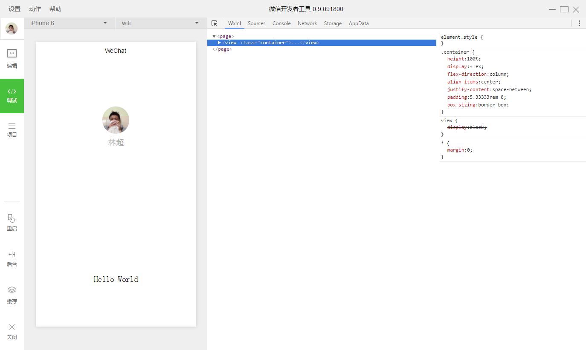


### 扫码登录

启动工具时，开发者需要使用已在后台绑定成功的微信号扫描二维码登录，**后续所有的操作都会基于这个微信帐号**

##二.程序调试
程序调试主要有三大功能区：模拟器、调试工具和小程序操作区

### 模拟器

模拟器模拟微信小程序在客户端真实的逻辑表现，对于绝大部分的 API 均能够在模拟器上呈现出正确的状态。

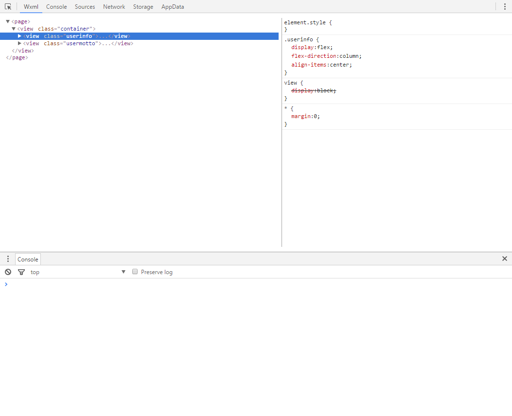


### 调试工具

调试工具分为 6 大功能模块：Wxml、Console、Sources、Network、Appdata、Storage以及

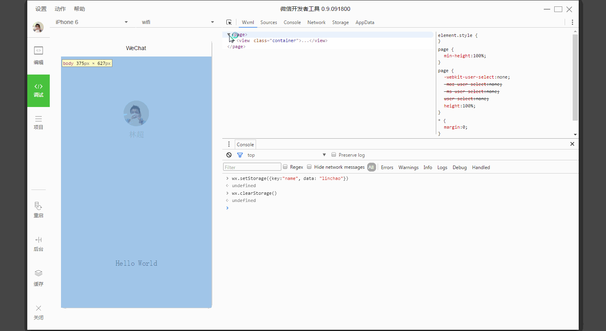


#### Wxml Pannel

Wxml Pannel 用于帮助开发者开发 Wxml 转化后的界面。在这里可以看到真实的页面结构以及结构对应的 wxss 属性，同时可以通过修改对应 wxss 属性，在模拟器中实时看到修改的情况。通过调试模块左上角的选择器，还可以快速找到页面中组件对应的 wxml 代码。

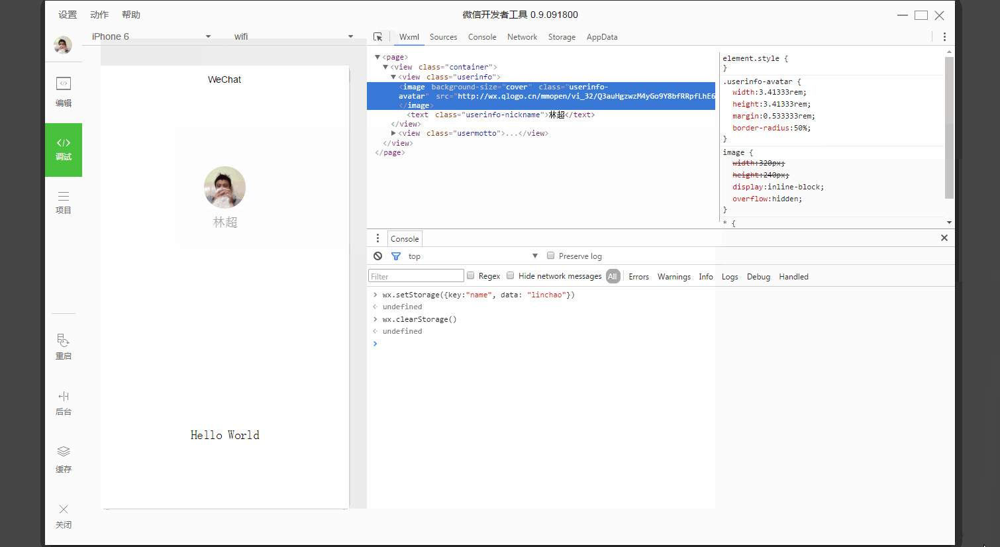

注意这是一个动图 https://mp.weixin.qq.com/debug/wxadoc/dev/image/devtools/wxml.gif?t=1474644089274


#### Sources Pannel

Sources Pannel 用于显示当前项目的脚本文件，同浏览器开发不同，微信小程序框架会对脚本文件进行编译的工作，所以在 Sources Pannel 中开发者看到的文件是经过处理之后的脚本文件，开发者的代码都会被包裹在 define 函数中，并且对于 Page 代码，在尾部会有 require 的主动调用。

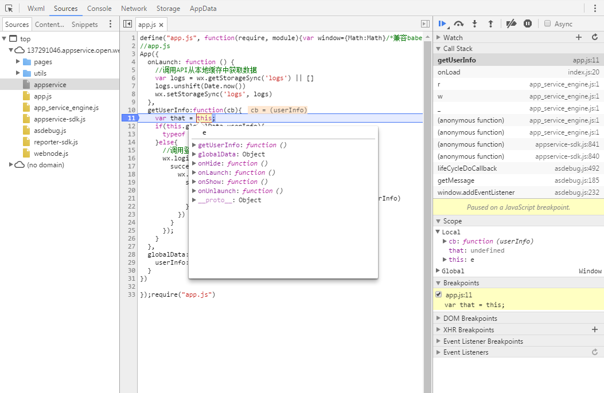

#### Network Pannel

Netwrok Pannle 用于观察和显示 request 和 socket 的请求情况

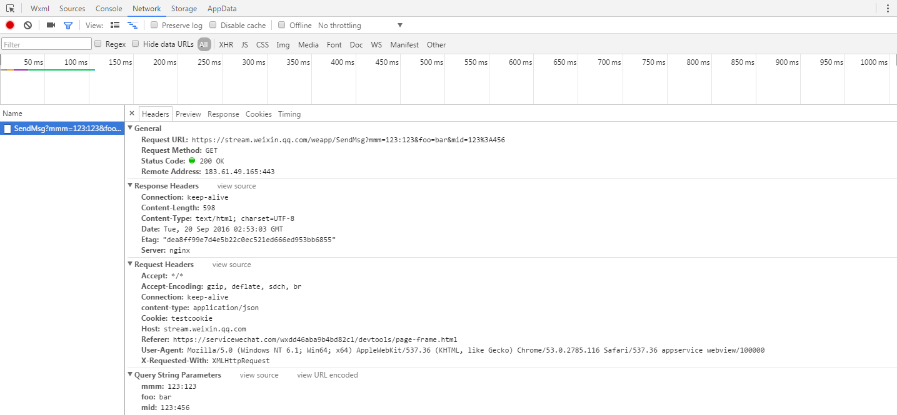


#### Appdata Pannel

Appdata Pannel 用于显示当前项目当前时刻 appdata 具体数据，实时地反馈项目数据情况，可以在此处编辑数据，并及时地反馈到界面上。

https://mp.weixin.qq.com/debug/wxadoc/dev/image/devtools/appdata.gif?t=1474644089274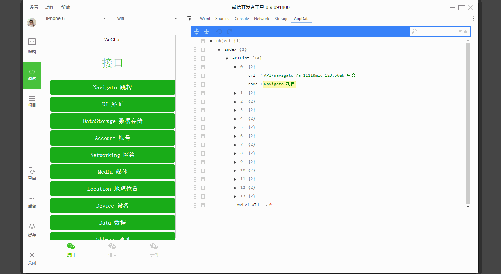


#### Storage Pannel

Storage Pannel 用于显示当前项目的使用 wx.setStorage 或者 wx.setStorageSync 后的数据存储情况。

https://mp.weixin.qq.com/debug/wxadoc/dev/image/devtools/storage.gif?t=1474644089274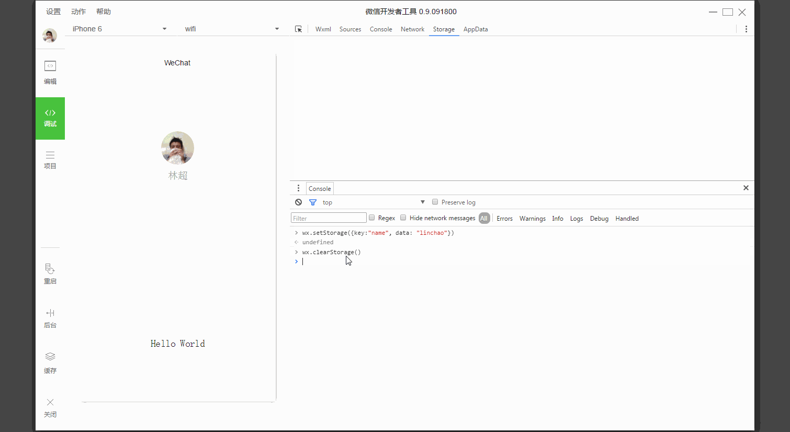


#### Console Pannel

Console Pannel 有两大功能：

*   开发者可以在此输入和调试代码

https://mp.weixin.qq.com/debug/wxadoc/dev/image/devtools/console1.gif?t=1474644089274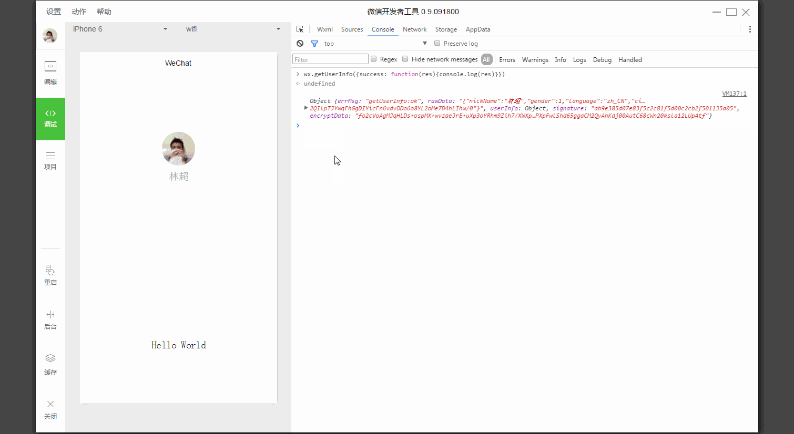


*   小程序的错误输出，会显示在此处

https://mp.weixin.qq.com/debug/wxadoc/dev/image/devtools/4.png?t=1474644089274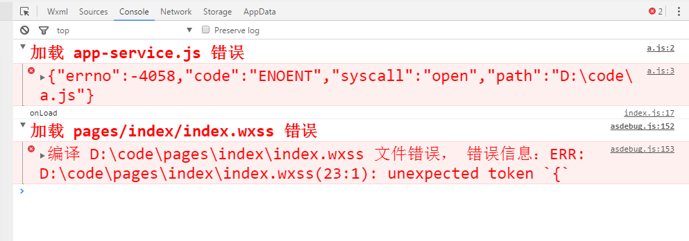


### 小程序操作区

小程序操作区帮助开发者模拟一些客户端的环境操作。例如当用户从小程序中回到聊天窗口，会触发一个小程序被设置为后台的api。

https://mp.weixin.qq.com/debug/wxadoc/dev/image/devtools/5.png?t=1474644089274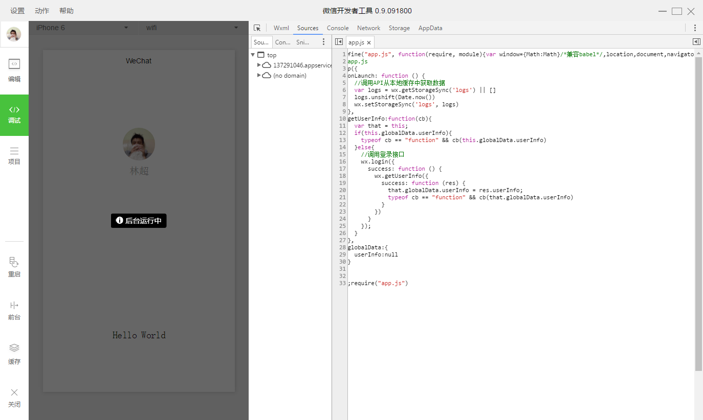


当小程序使用到多窗口的时候，可以在顶部操作区进行页面切换，需要注意的是这个操作只是为了方便开发者才存在的，在真实的微信客户端中是不会有的。

https://mp.weixin.qq.com/debug/wxadoc/dev/image/devtools/7.png?t=1474644089274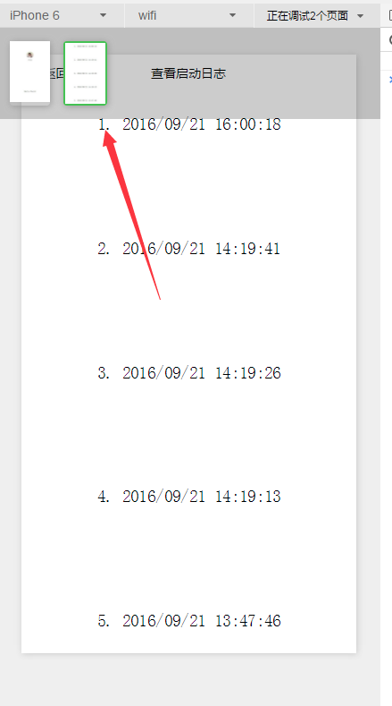


##三.代码编辑

编辑区可以对当前项目进行代码书写工作，同时可以对文件进行基本的添加、删除以及重命名。

工具目前提供了4种文件的编辑：wxml wxss js json

## 自动补全

同大部分编辑器一样，我们提供了完善的自动补全

https://mp.weixin.qq.com/debug/wxadoc/dev/image/devtools/edit1.gif?t=1474644089517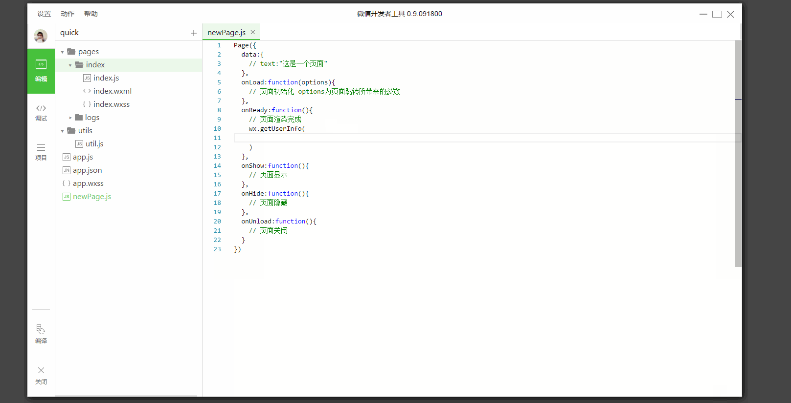


https://mp.weixin.qq.com/debug/wxadoc/dev/image/devtools/edit2.gif?t=1474644089517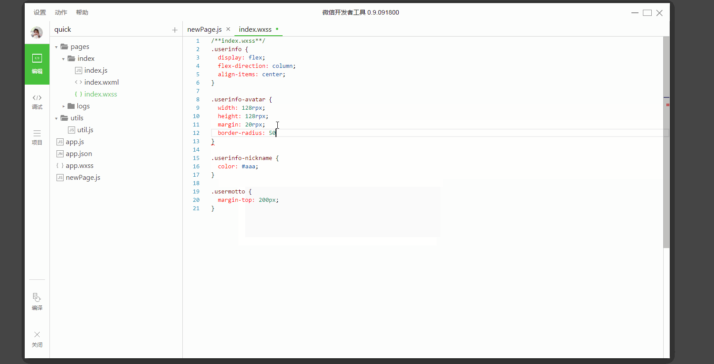


## 常用快捷键

### 格式调整

*   Ctrl+S：保存文件

*   Ctrl+[， Ctrl+]：代码行缩进

*   Ctrl+Shift+[， Ctrl+Shift+]：折叠打开代码块

*   Ctrl+C Ctrl+V：复制粘贴，如果没有选中任何文字则复制粘贴一行

*   Shift+Alt+F：代码格式化

*   Alt+Up，Alt+Down：上下移动一行

*   Shift+Alt+Up，Shift+Alt+Down：向上向下复制一行

*   Ctrl+Shift+Enter：在当前行上方插入一行

### 光标相关

*   Ctrl+End：移动到文件结尾

*   Ctrl+Home：移动到文件开头

*   Ctrl+i：选中当前行

*   Shift+End：选择从光标到行尾

*   Shift+Home：选择从行首到光标处

*   Ctrl+Shift+L：选中所有匹配

*   Ctrl+D：选中匹配

*   Ctrl+U：光标回退

##四.代码预览

项目目录显示的是当前项目的一些细节情况，包括图标、appid、目录信息等等。

​点击预览功能，工具会自动编译和构建代码，并生成代码包上传到微信服务器，成功后将会显示一个二维码，开发者用新版微信扫描二维码即可在手机上看到相应项目的真实表现

需要注意的是，内测阶段，代码上传 功能仅管理员微信号可操作。


##五.下载地址

0.9.092300
windows 64 https://servicewechat.com/wxa-dev-logic/download_redirect?type=x64&from=mpwiki&t=1474644089434

windows 32 https://servicewechat.com/wxa-dev-logic/download_redirect?type=ia32&from=mpwiki&t=1474644089434

mac https://servicewechat.com/wxa-dev-logic/download_redirect?type=darwin&from=mpwiki&t=1474644089434


##六.Q&A

## 怎么获取用户输入

能够获取用户输入的组件，需要使用组件的属性`bindchange`将用户的输入内容同步到 AppService。

```xml
<input id="myInput" bindchange="bindChange" />
<checkbox id="myCheckbox" bindchange="bindChange" />
```

```javascript
  var inputContent = {}

Page({
  data: {
    inputContent: {}
  },
    bindChange: function(e) {
        inputContent[e.currentTarget.id] = e.detail.value
    }
})
```


### 为什么脚本内不能使用`window`等对象

页面的脚本逻辑在是在`JsCore`中运行，`JsCore`是一个没有窗口对象的环境，所以不能再脚本中使用`window`，也无法在脚本中操作组件

### 为什么 zepto/jquery 无法使用

zepto/jquery 会使用到`window`对象和`document`对象，所以无法使用。

### `wx.navigateTo`无法打开页面

 一个应用同时只能打开5个页面，当已经打开了5个页面之后，`wx.navigateTo`不能正常打开新页面。请避免多层级的交互方式，或者使用`[wx.redirectTo](../api/ui-navigate.md#wxredirecttoobject)`

### 样式表不支持级联选择器

WXSS支持以`.`开始的类选择器。如：

```xml
  .normal_view {
  color: #000000;
  padding: 10px;
}
```

可以使用标签选择器，控制同一类组件的样式。如：使用input标签选择器控制`&lt;input/&gt;`的默认样式。
   
```xml
input {
  width: 100px;
}
```

## 本地资源无法通过 css 获取

`background-image`：可以使用网络图片，或者 base64，或者使用`&lt;image/&gt;`标签

## 如何修改窗口的背景色

使用 page 标签选择器，可以修改顶层节点的样式

```css
page {
  display: block;
  min-height: 100%;
  background-color: red;
}
```